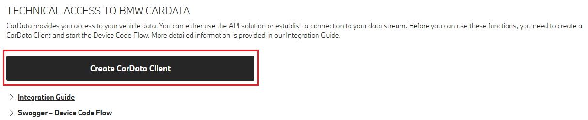
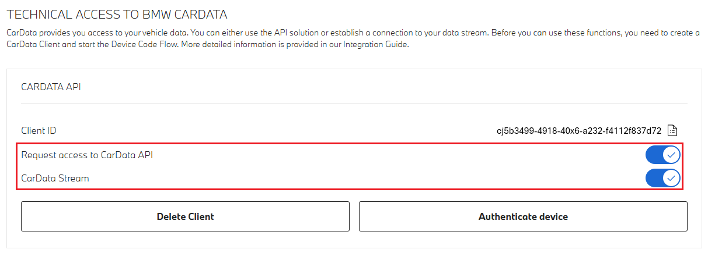
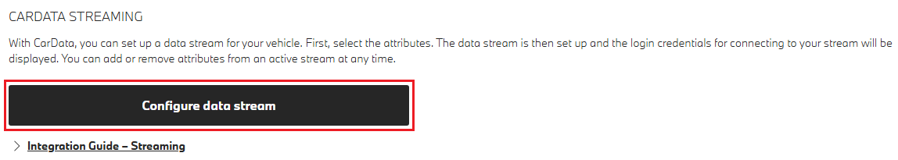

# BMW CarData Go Client

Go client for the public BMW CarData API. This library provides a typed, user-friendly interface to authenticate users and access BMW CarData resources from Go applications.

Official API reference: [BMW CarData Public API documentation](https://bmw-cardata.bmwgroup.com/customer/public/api-documentation)

Note: This project is an independent, community-maintained client and is not affiliated with, endorsed by, or supported by BMW Group.

## Installation

```bash
go get github.com/tjamet/bmw-cardata@latest
```

## Preliminary (required BMW side setup)

As documented by BMW, you will need to activate your own client ID to be able to use this library.

In short, you will need to access your BMW garage (for example [here](https://www.bmw.co.uk/en-gb/mybmw/vehicle-overview) for BMW UK) and access "BMW CarData" for your vehicle.

Then, 'Create CarData Client' (note: this client ID currently disapears on reload. Make sure to save it)



Make sure you tick at least the 'Request access to CarData API'.



To enable streaming, you also need to enable `CarData Stream` permissions and also subscribe to all the events you want to receive.



⚠️ Note that you can only enable streaming once you have generated a new "client". If you missed this configuration, you will have to restart the client generation to select individual events to be streamed

## Quick start (top-level module)

The top-level package is `bmwcardata`. Create an `Authenticator` to run the device-code flow, then construct a `Client` using options. The default API host is `https://api-cardata.bmwgroup.com`.

```go
package main

import (
    "context"
    "fmt"
    "log"

    bmwcardata "github.com/tjamet/bmw-cardata"
)

func main() {
    // Your BMW-assigned client ID (UUID string)
    clientID := "00000000-0000-0000-0000-000000000000"

    authenticator := bmwcardata.Must(bmwcardata.NewAuthenticator(
        bmwcardata.WithClientID(clientID),
        // PromptURI is called to guide the user through the device-code login
        bmwcardata.WithPromptURI(func(verificationURI, userCode, verificationURIComplete string) {
            fmt.Printf("Open %s and enter code %s\n", verificationURI, userCode)
            // Or directly open verificationURIComplete in a browser
            fmt.Printf("Direct link: %s\n", verificationURIComplete)
        }),
        // Optionally persist the session locally
        bmwcardata.WithSessionStore(&bmwcardata.FileSessionStore{Path: "bmw_session.json"}),
        // Optionally customize scopes (defaults include openid, cardata:api:read, cardata:streaming:read, authenticate_user)
        // bmwcardata.WithScopes([]bmwcardata.Scope{bmwcardata.ScopeCardataAPI}),
    ))

    client := bmwcardata.Must(bmwcardata.NewClient(
        bmwcardata.WithAuthenticator(authenticator),
        // Optionally override API host
        // bmwcardata.WithCarDataServer("https://api-cardata.bmwgroup.com"),
    ))

    ctx := context.Background()

    // Example call: fetch basic data for a VIN
    vin := "WBA00000000000000"
    vehicle, err := client.GetBasicData(ctx, vin)
    if err != nil {
        log.Fatal(err)
    }
    fmt.Printf("Vehicle: %+v\n", vehicle)
}
```

### Authentication

This library uses the BMW device authorization flow. When you create an `Authenticator`, you must:

- Provide your BMW-assigned client ID via `WithClientID`.
- Supply a `WithPromptURI` callback to display the verification URL and user code, or open the direct link for the user. The library then polls until the user completes authentication and returns an `AuthenticatedSession`.
- Optionally persist the session with `FileSessionStore` (or implement your own `SessionStore`).

Scopes default to a safe set: `openid`, `cardata:api:read`, `cardata:streaming:read`, and `authenticate_user`. You can override with `WithScopes`.

### Error handling

Errors include HTTP context and, when available, structured payloads from the API. Log and handle them appropriately; avoid leaking sensitive information.

### Status and roadmap

This client is being developed against the public BMW CarData specification. Coverage will expand as endpoints are implemented and stabilized. Contributions and issue reports are welcome.

### Contributing

Issues and pull requests are welcome. Please:

1. Open an issue describing the change or bug.
2. Include minimal, reproducible examples when relevant.
3. Add tests for new behavior where applicable.

### Disclaimer

This is an unofficial client. You are responsible for complying with BMW CarData terms, data protection, and customer consent requirements. Review and follow the official documentation: [BMW CarData Public API documentation](https://bmw-cardata.bmwgroup.com/customer/public/api-documentation).
